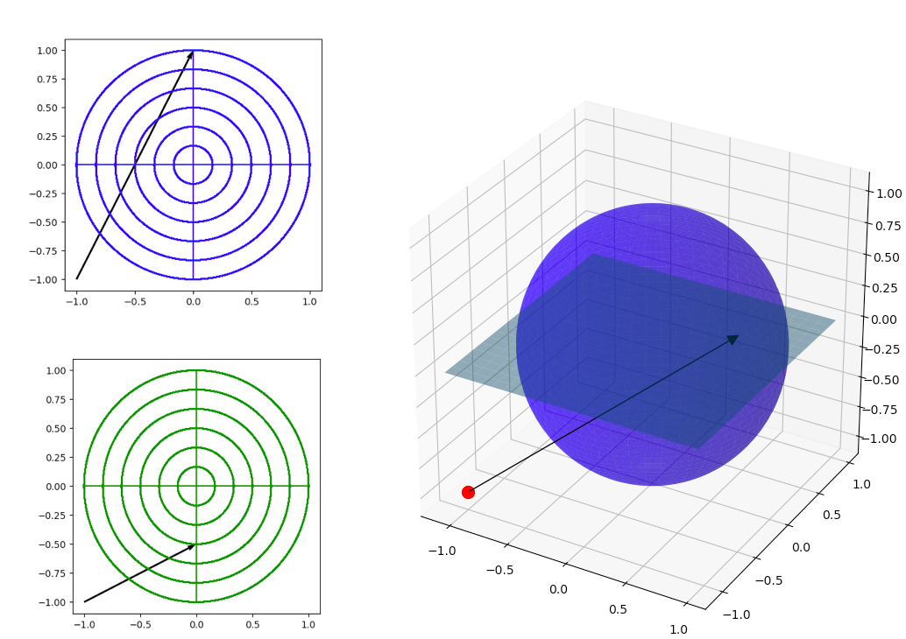

# Fast Voxel Traversal Algorithm Over Spherical Grids


## About
[](https://app.circleci.com/pipelines/github/spherical-volume-rendering/svr-algorithm)

This project extends the [yt](https://yt-project.org/) open-source data analysis and visualization package, providing an enhanced, integrated user interface for data exploration and enabling the visualization of physical data that comes from non-cartesian grids. Currently, yt implements a fast voxel traversal over a cartesian coordinate grid. The objective is to develop a fast voxel traversal over a spherical coordinate grid, based on ideas from Amanatides and Woo’s seminal paper on fast voxel traversal for ray tracing.

## Authors
- Chris Gyurgyik (cpg49 at cornell.edu)
- Ariel Kellison (ak2485 at cornell.edu)
- Youhan Yuan (yy435 at cornell.edu)

## Initial Benchmarks*
| # Rays 	| # Voxels 	| CPU Mean (ms) 	| CPU Median (ms) 	| CPU Std Dev (ms) 	|
|--------	|----------	|---------------	|-----------------	|------------------	|
| 128^2  	| 64^3     	| 233           	| 233             	| 1.0              	|
| 256^2  	| 64^3     	| 928           	| 926             	| 4.5              	|
| 512^2  	| 64^3    	| 3717          	| 3713            	| 24.1            	|
| 128^2  	| 128^3    	| 463           	| 462             	| 2.2              	|
| 256^2  	| 128^3    	| 1838          	| 1833            	| 12.0             	|
| 512^2  	| 128^3    	| 7346          	| 7324            	| 16.9            	|

<sup>\*Run on (4 X 1600 MHz CPUs). </sup>
<sup>CPU Caches: L1 Data 32 KiB (x2), L1 Instruction 32 KiB (x2), L2 Unified 256 KiB (x2), L3 Unified 3072 KiB (x1)</sup>

## C++ Build Requirements
- [CMake 3.7 or later](https://cmake.org/)
- C++11-standard-compliant compiler

#### To run the benchmarks: 
1. Download CMake version 3.7 or higher (https://cmake.org/)
2. Clone the repository and build the benchmarks:
```
git clone https://github.com/spherical-volume-rendering/svr-algorithm.git && 
cd svr-algorithm/cpp/benchmarks && mkdir build && cd build && cmake .. && make
```
3. Run the benchmarks:
```
cd .. && ./bin/benchmark_SVR
```

### C++ Example
```
#include "spherical_volume_rendering_util.h"

const BoundVec3 min_bound(-20.0, -20.0, -20.0);
const BoundVec3 max_bound(20.0, 20.0, 20.0);
const BoundVec3 sphere_center(0.0, 0.0, 0.0);
const double sphere_max_radius = 10.0;
const std::size_t num_radial_sections = 4;
const std::size_t num_angular_sections = 4;
const std::size_t num_azimuthal_sections = 4;
const svr::SphericalVoxelGrid grid(min_bound, max_bound, 
                                   num_radial_sections, 
                                   num_angular_sections,
                                   num_azimuthal_sections, 
                                   sphere_center, sphere_max_radius);
const BoundVec3 ray_origin(-13.0, -13.0, -13.0);
const FreeVec3 ray_direction(1.0, 1.0, 1.0);
const Ray ray(ray_origin, ray_direction);
const double t_begin = 0.0;
const double t_end = 30.0;
const auto voxels = walkSphericalVolume(ray, grid, t_begin, t_end);
```

## Cython Build Requirements
- [Python3](https://www.python.org/)
- [Cython](https://cython.org/)
- [Numpy](https://numpy.org/)
- [distutils](https://docs.python.org/3/library/distutils.html)

### Cython Example
```
#   Compile code before use:
#   python cython_SVR_setup.py build_ext --inplace

import cython_SVR
import numpy as np

ray_origin =    np.array([-13.0, -13.0, -13.0])
ray_direction = np.array([1.0, 1.0, 1.0])
min_bound =     np.array([-20.0, -20.0, -20.0])
max_bound =     np.array([20.0, 20.0, 20.0])
sphere_center = np.array([0.0, 0.0, 0.0])
sphere_max_radius =     10.0
num_radial_sections =    4
num_angular_sections =   4
num_azimuthal_sections = 4
t_begin = 0.0
t_end =  30.0
voxels = cython_SVR.walk_spherical_volume(ray_origin, ray_direction, min_bound, max_bound, 
                                          num_radial_sections, num_angular_sections, 
                                          num_azimuthal_sections, sphere_center,
                                          sphere_max_radius, t_begin, t_end)
```

### Project Links
- [Initial Proposal](https://hackmd.io/VRyhXnAFQyaCytWCdKe_1Q)
- [Feasibility Study](https://docs.google.com/document/d/1MbGmy5cSSesI0oUCWHxpiwcHEw6kqd79AV1XZW-rEZo/edit)
- [Progress Report 1](https://docs.google.com/document/d/1ixD7XNu39kwwXhvQooMNb79x18-GsyMPLodzvwC3X-E/edit?ts=5e5d6f45#)

### References
- John Amanatides and Andrew Woo. A fast voxel traversal algorithm for ray tracing. In Eurographics ’87, pages 3–10, 1987.
- James Foley, Andries van Dam, Steven Feiner & John Hughes, "Clipping Lines" in Computer Graphics (3rd Edition) (2013)
- Paul S. Heckbert, editor. Graphics Gems IV.  Academic Press Professional, Inc., USA, 1994.
- Donald. E. Knuth, 1998, Addison-Wesley Longman, Inc., ISBN 0-201-89684-2, Addison-Wesley Professional; 3rd edition.
- Joseph O'Rourke, "Search and  Intersection" in Computational Geometry in C (2nd Edition) (1998)
